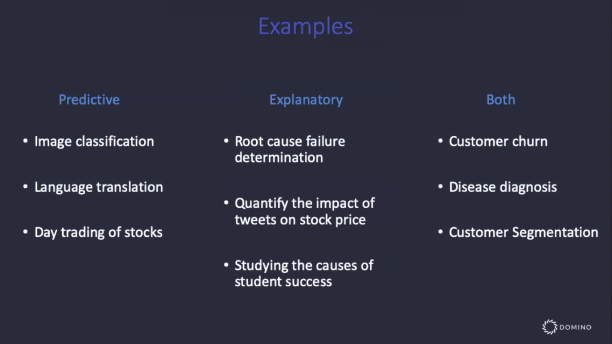
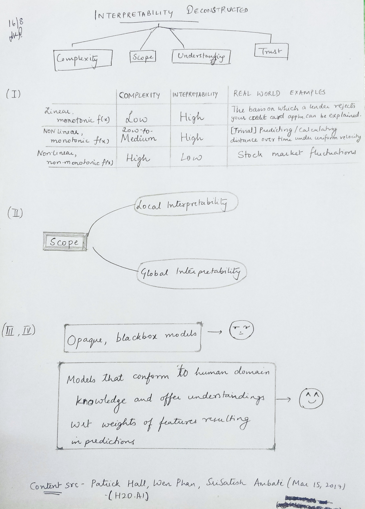

I attended this Webinar titled <a href="https://www.brighttalk.com/webcast/17563/366621" style="color:blue">"A Data Science Playbook for Explainable ML/AI"</a> conducted by Chief Data Scientist,Josh Poduska, and VP of Marketing, Jon Rooney of Domino Data. This post lays out some of the highlights (in my opinion) of the talk, peppered with my understandings and some additional points that might be of interest. I will breaking this learning-post up into two parts - the first part discussing the theoretical concepts of interpretability and Part-2 on different Open Source models that are in practice today. This is Part-1.

The first question they started off with was probably one that was on everyone's mind - `Why care about Model Interpretability?`.
The reasons they provided were threefold -
- Model ethics, bias and misuse
- Regulatory requirements
- Trust and understanding

Apart from the 2nd reason that most models *will* need to be regulated from a corporate standpoint soon, it's not hard to see why it's intuitive that models that can be **understood logically** internally, are easier to trust than a blackbox model that just spits out results. It's also easy to spot bias if the model's working can be understood.

Model Interpretability can broadly be bifurcated into two categories -  `Global Interpretability` & `Local Interpretability`.

The example presented to illustrate the meaning of Global and Local interpretability was that of the purchase of multi-game tickets next year and to try and see which model would help predict this best. 
 `(1)` A model that would help **pick out** almost all the people that would purchase multi-game tickets next year. 
 `(2)` A model that told you what **combination of characteristics** of a buyer are strongly associated with multi-game purchases.
 `(3)` A model that told you why it thinks why a particular **person** would or would not purchase multi-game tickets.

 - In `Model (1)`, you get a high level of accuracy in that you get exactly what you want - the entire set of individuals that are likely to purchase a multi-game ticket and once you get this and it works, you don't really care about how this works, because it works. There is no interpretability here.
 - `Model(2)` is an example of one with global interpretability. This is because you're able to justify to external stakeholders why your model tells you a group of buyers will or will not buy a multi-game ticket based on the entire dataset. Examples of predictions made by this model are "In general, people who purchased cheap seats in advance are unlikely to purchase a multi-game ticket" or "People who made a last-minute purchase are likely to buy a multi-game ticket."
 - `Model(3)` is indicative of local interpretability because it might tell you that a **certain individual 'X'** is likely to purchase a ticket with a probability of 0.82 because of contributing factors/features like seat location (38%), the fact that he purchased the ticket 3 days in advance (22%), his age (17%) and because he spent more on concessions (5%).

Models can therefore be `predictive` or `explanatory` or both. If it's a case where you care more about immediate, accurate results than about explaining what's going on, you just want a predictive model (for e.g. Language translation). On the other hand, a medical prediction probably deserves both accuracy and explanations on how the predictions were made. More real-world usecases of where they're respectively applicable are shown in the table below -

In mathematical terms, let there be a set of inputs `X`, that cause a response `Y` via a function `F`, such that `Y=F(X)`.
Then if `x` and `y` are samples from X and `Y` respectively, and `f` is a model that approximates `F`, then - 
- Interpretable modeling seeks an `f` that best explains `F` 
- Predictive modeling seeks an `f` that best predicts `y`.

Ideally, we'd like to find a model `f` that explains `F` and predicts `y` but that is a practical impossibility, therefore "tradeoffs must be made".

#### "Oldy-but-goody" Techniques that offer local/global interpretability

| Technique  | Local  | Global   |
|---|---|---|
|Linear Regression (prediction)| :heavy_check_mark: | -  |
|  Fully specified model (coefficients) | -  | :heavy_check_mark:  |
| Response Surface  | :heavy_check_mark:  | - |
| Prediction Surface  | - | :heavy_check_mark:  |
| Point Prediction Error Bands  |:heavy_check_mark: | - |
| Partial Dependency Plots  |- | :heavy_check_mark:  |
| Variable Importance Plots (from Random Forest/XGBoost)  |- | :heavy_check_mark:  |

I didn't quite understand their explanation wrt the first two rows. I'll need to read more to justify the difference between them.

This is where we'll mark the logical end of this part of the post. The next part will discuss Open Source tools in practice and how effective they are w.r.t ML Interpretability - e.g. SHAP, LIME, InterpretML etc.

#### <u>Additional notes :
- Interpretability of models, as we've seen is very critical in good Machine Learning practice, but what is also important is `reproducibility` (which is something of a by-product of the former but needs addressing.). This helps in increased accountability and also as a practice to be able to obtain consistent results across repeated experiments. A good case for  to this end is made in this talk -  <a href="https://slideslive.com/38915883/how-can-reproducibility-support-understanding" style="color:blue">https://slideslive.com/38915883/how-can-reproducibility-support-understanding</a>

#### <u> Links & references that might help in understanding ML Interpretability and related concepts better -</u>
- <a href="https://www.oreilly.com/ideas/ideas-on-interpreting-machine-learning" style="color:blue">https://www.oreilly.com/ideas/ideas-on-interpreting-machine-learning</a> 
- <a href="https://www.kdnuggets.com/2018/06/human-interpretable-machine-learning-need-importance-model-interpretation.html" style="color:blue">https://www.kdnuggets.com/2018/06/human-interpretable-machine-learning-need-importance-model-interpretation.html</a>
- <a href="https://www.kaggle.com/dansbecker/partial-dependence-plots" style="color:blue">https://www.kaggle.com/dansbecker/partial-dependence-plots</a>

#### <u> Source for the meat of the matter wrt definitions, images (etc) -</u>
- <a href="https://www.brighttalk.com/webcast/17563/366621" style="color:blue">https://www.brighttalk.com/webcast/17563/366621</a>

Here's TL;DR version of this post -



<noscript>Please enable JavaScript to view the <a href="https://disqus.com/?ref_noscript">comments powered by Disqus.</a></noscript>
