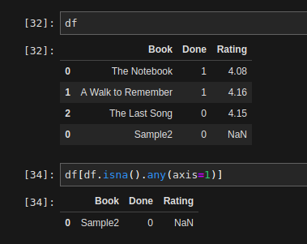
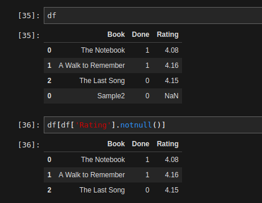

**Get rows with NaNs in any column** 
> `df[df.isna().any(axis=1)]`

**Get dataframe excluding all NaNs in a particular Column** 
> `df[df['<col_name>'].notnull()]`

**Get counts of number of Nulls per column**
> `df.isnull().sum()`

**Increase width of columns displayed in Jupyter Notebooks**
- This is possibly one of my most used commands for every notebook that involves dataframes.

> `pd.set_option('display.max_colwidth',400)`
