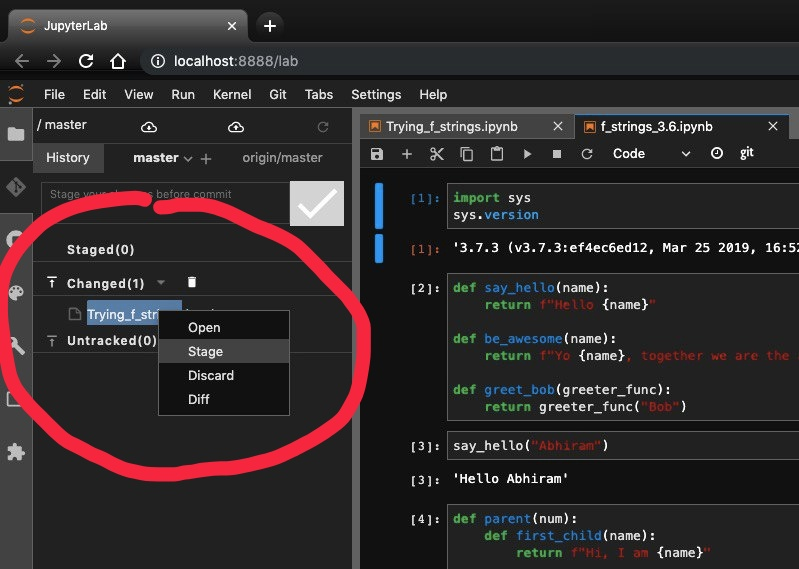
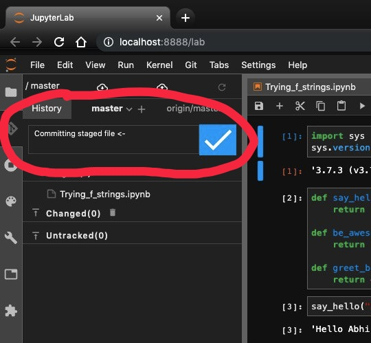
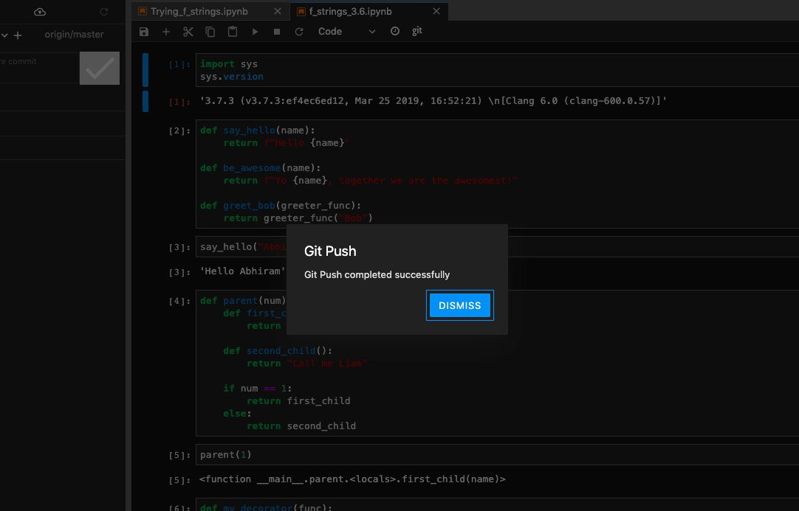

[Extensions in Jupyter-lab are still very much experimental. But this one seems to be working fabulously so far.]

Jupyterlab-git is an extension that lets you stage and commit changes to notebooks made right from within the Jupyterlab interface.

This is best installed within the confines of a virtual environment, as is anything experimental.

#### Installation steps -

a) Ensure that you have the latest version of jupyterlab (=1.2.0 at the time of this writing) and NodeJS(=12.13.0 at this time)
~~~~
 pip install -U jupyterlab
~~~~

b) Install jupyterlab-git
~~~~
 pip install --upgrade jupyterlab-git
~~~~

c) Build jupyter
~~~~
 jupyter lab build
~~~~

d) Enable jupyterlab_git
~~~~
 jupyter serverextension enable --py jupyterlab_git --sys-prefix
~~~~

e) Run jupyter-lab
~~~~
 jupyter-lab
~~~~

<u>In Jupyter-lab</u>

f) Enable the Extensions Manager (experimental)

g) Search for and Install jupyterlab-git extension. You'll be asked to Rebuild Jupyter.

h) Once the Git extension shows up post rebuilding, you can stage any changes made per notebook.

i) Commit post-staging

j) Push!

If you see this, you're successfully done :)

#### Additional reference links - 

- <a href="https://github.com/jupyterlab/jupyterlab-git" style="color:blue">https://github.com/jupyterlab/jupyterlab-git</a>
- <a href="https://github.com/jupyterlab/jupyterlab-git/issues" style="color:blue">Looking through the issues help a lot!</a>



<noscript>Please enable JavaScript to view the <a href="https://disqus.com/?ref_noscript">comments powered by Disqus.</a></noscript>

