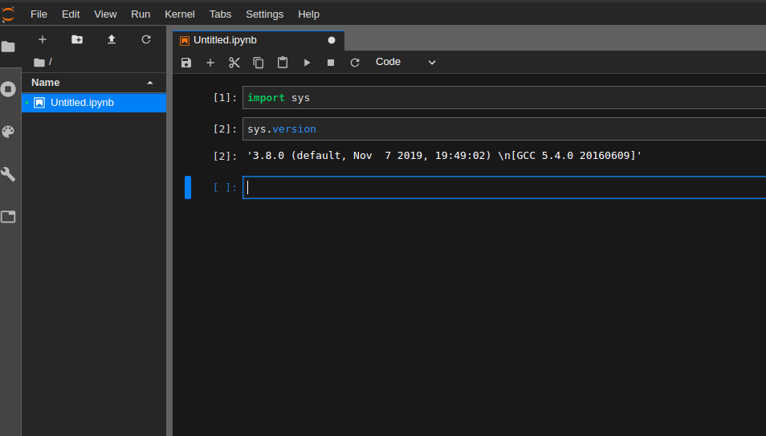

I'm using Ubuntu 16.04 on this machine, so that's what the steps of installation here will be for. But this installation shouldn't largely vary on any distro that's 14.04 and higher.

#### Step 1 - Download Python source code 

Binary installations are available for Windows and Mac but you can either install Python3.8 on Ubuntu using "apt" or download and install from source. I did the latter. 
Obtain the gz file from <a href="https://www.python.org/downloads/release/python-380/" style="color:blue">here</a>.
~~~~
 cd <path-of-archive>
 tar zxvf Python-3.8.0.tgz
 cd Python-3.8.0
 ./configure
 make
 sudo make altinstall
~~~~
We use `make altinstall` instead of `make install` so that your existing Python configuration not be disturbed.

This process should likely complete in under a minute.

#### Step 2 - Install python3.8 specific virtualenv

There are a few differences in Python3.8 that prevent your existing virtualenv from being useful in creating a virtual environment supporting this version of Python. So install virtualenv corresponding to Python3.8.

~~~~
 sudo pip3.8 install virtualenv
~~~~

This should likely be installed in `/usr/local/bin/`. So, confirm that it exists -
~~~~
 /usr/local/bin/virtualenv --version 
~~~~
`(should return the latest version of virtualenv = 16.7.7 as of this writing)`

#### Step 3 - Create a virtual environment

Use the installation of virtualenv created in `Step 2` to create a virtual environment with the Python path pointed to python3.8 (-p). Preferably create a folder for all your virtual environments if you don't have a preferred directory already.

~~~~
 cd
 mkdir .virtual_environments
 cd .virtual_environments
 /usr/local/bin/virtualenv -p python3.8 <name of environment>
~~~~

Example - `/usr/local/bin/virtualenv -p python3.8 py38`

#### Step 4 - Activate this environment and install jupyterlab in it. 

`cd` to the folder where you created the virtual environment. Using the environment we created in Step 3 - 

~~~~
 cd ~/.virtual_environments
 source py38/bin/activate
 pip list (You should see only a few packages in your new environment.)
 pip install jupyterlab
~~~~

Now you can traverse to the directory where you want your Jupyter-lab notebook to be spawned and trigger it using `jupyter-lab` and the default <a href="https://stackoverflow.com/questions/52370092/what-is-a-kernel-in-jupyter-notebook-and-how-it-is-different-similar-to-actual-k/" style="color:blue">kernel</a> (if you don't have any other kernel installed) that will be picked up will be running Python3.8.

## Fin.



<noscript>Please enable JavaScript to view the <a href="https://disqus.com/?ref_noscript">comments powered by Disqus.</a></noscript>

