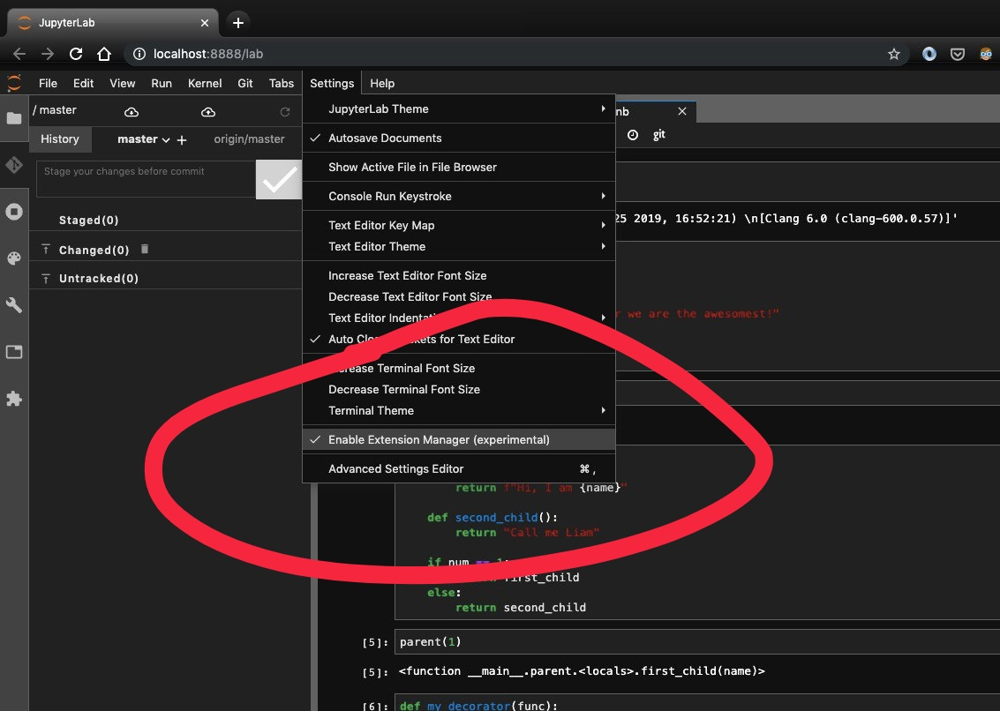

Jupyterlab is a definite improvement on the older IPython notebook interface - both in features and in appearance. There is now even an in-built "Dark Theme" that can be enabled. 

But is that all?

As we know, Jupyterlab is a browser based app and is ipso facto, written on a base of HTML, CSS and Javascript. So if we want to change the appearance over and above what we get out of the box with jupyterlab, we can. 
Now, it <i>is</i> possible to make any CSS changes by hacking into the internals of the notebook, but thanks to a nifty Jupyterlab extension by Adam Wallner, we don't have to.

Check out <a href="https://abhiramr.com/2019-11-07-Setting-Up-Python38-Jupyter-lab/" style="color:blue">Step 4 of my previous post</a> for preliminary installation steps, if you don't already have Jupyterlab installed.

#### Steps -

a) Install custom_css
~~~~
 jupyter labextension install @wallneradam/custom_css
~~~~

b) Run jupyter-lab
~~~~
 jupyter-lab
~~~~

<u>In Jupyter-lab</u>

c) Enable the Extensions Manager (experimental)

d) Navigate to the advanced settings editor

e) Navigate to the custom-css pane and your "User Preferences" section is expected to be largely empty unlike in the populated figure below.

f) Let me explain the block of code added above in "User Preferences" (sans comments)

~~~~
{
  "rules": 
  [
    {
	"selector": "#jp-MainLogo",
	"styles": 
    [
    "display:block",
    "background: url('https://abhiramr.com/img/sharingan.jpeg') no-repeat",
    "background-size: contain",
    "width: 23px",
    "height: 45px",
    "padding-left: 0px",
    "-moz-box-sizing: border-box",
    "box-sizing: border-box"
    ]
	},
	{
    "selector": ".jp-Notebook .jp-Cell.jp-mod-active .jp-Collapser",
    "styles": ["background:#50bd30"]
	}
  ]
}
~~~~

We have a list of `rules` whose members are elements that are to be styled. Each element member is a dictionary, identified by a `selector` that can be a tag, a class or an id (or any selector). Each member also consists of list - `style` in which we list out every custom property we wish to bestow upon the element. If a particular element is identified by multiple ids or classes as is normally the case, they are just all listed in the `selector` separated by spaces.

In this example, I've chosen to modify two elements - (i) the icon on the top left corner of the notebook that is normally the standard Jupyter notebook icon and (ii) The highlighted color that indicates the current active cell in the notebook. 

And now, in classic weight-loss program fashion, here are the before and after pics for each of the changes made.

#### Before :

#### After :

#### Finally - 

#### Additional reference links - 

- <a href="https://github.com/wallneradam/jupyterlab-custom-css" style="color:blue">https://github.com/wallneradam/jupyterlab-custom-css</a>



<noscript>Please enable JavaScript to view the <a href="https://disqus.com/?ref_noscript">comments powered by Disqus.</a></noscript>

